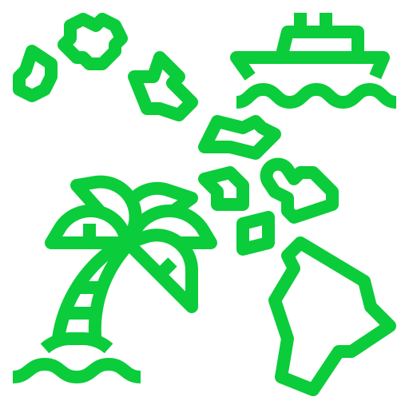
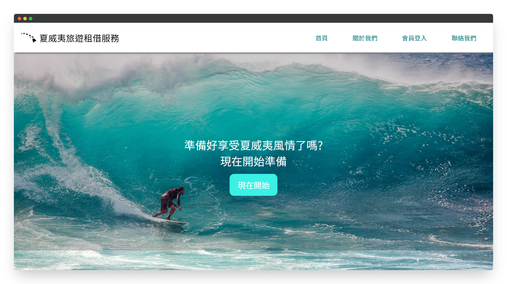
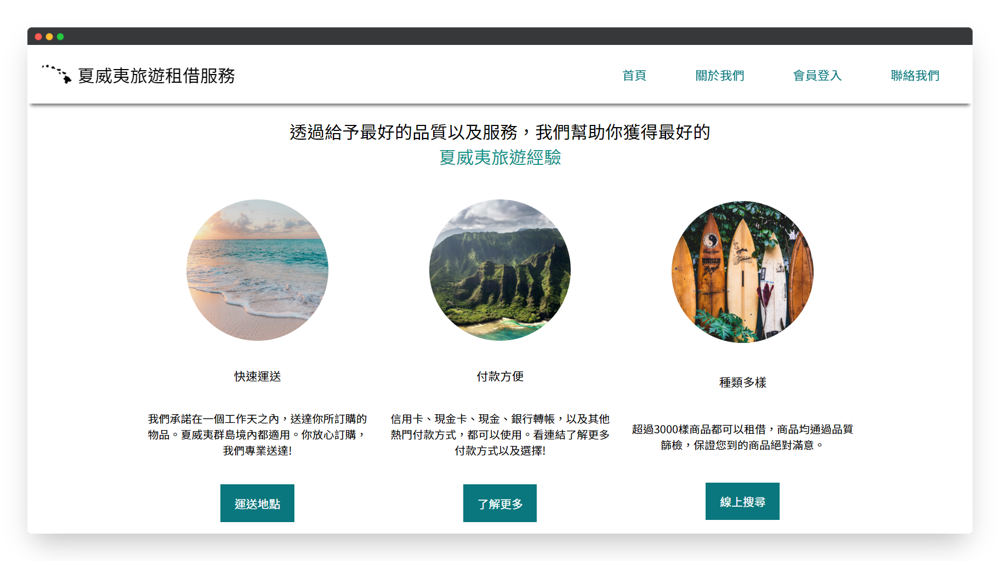
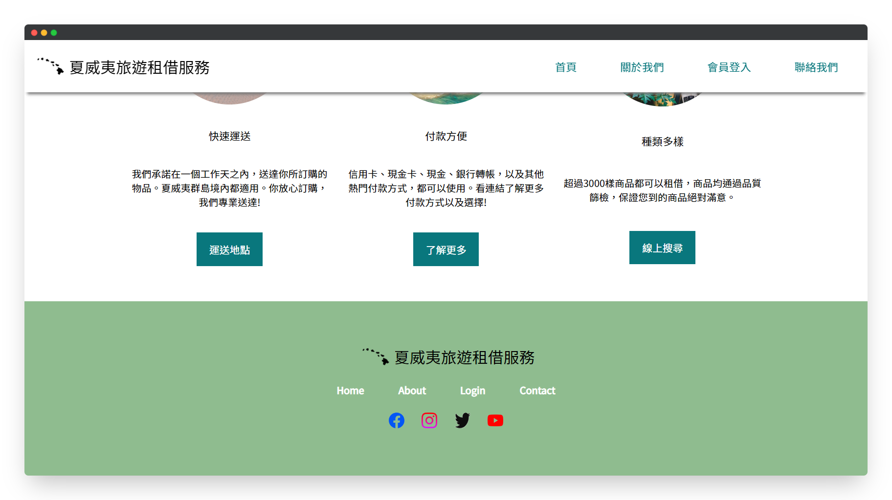
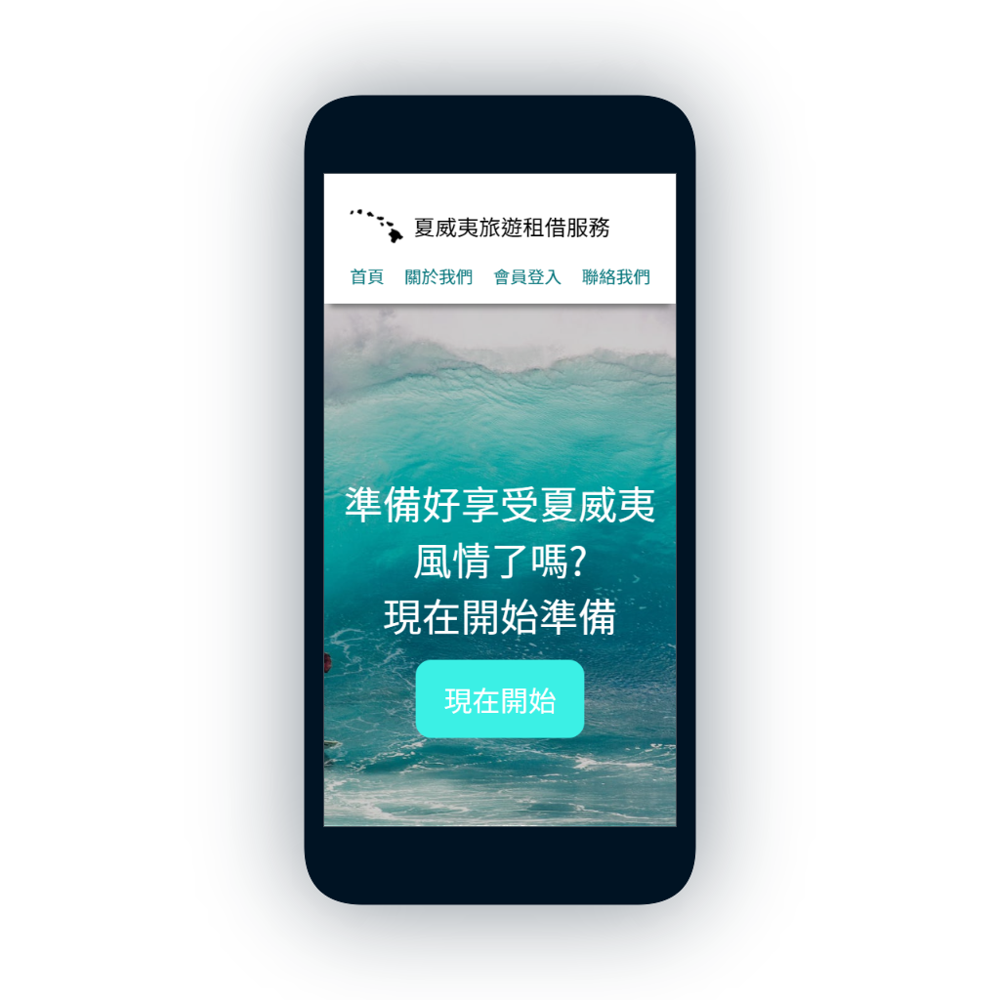
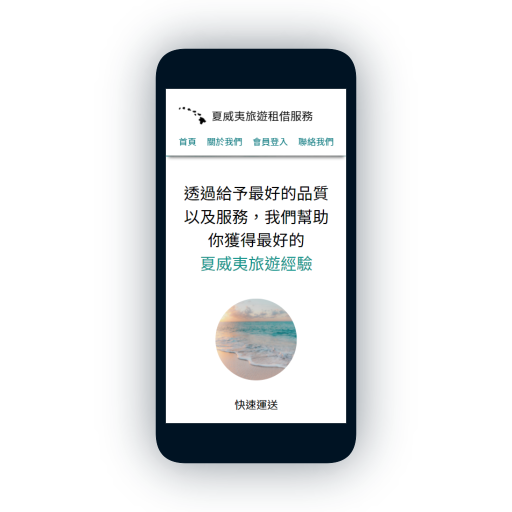
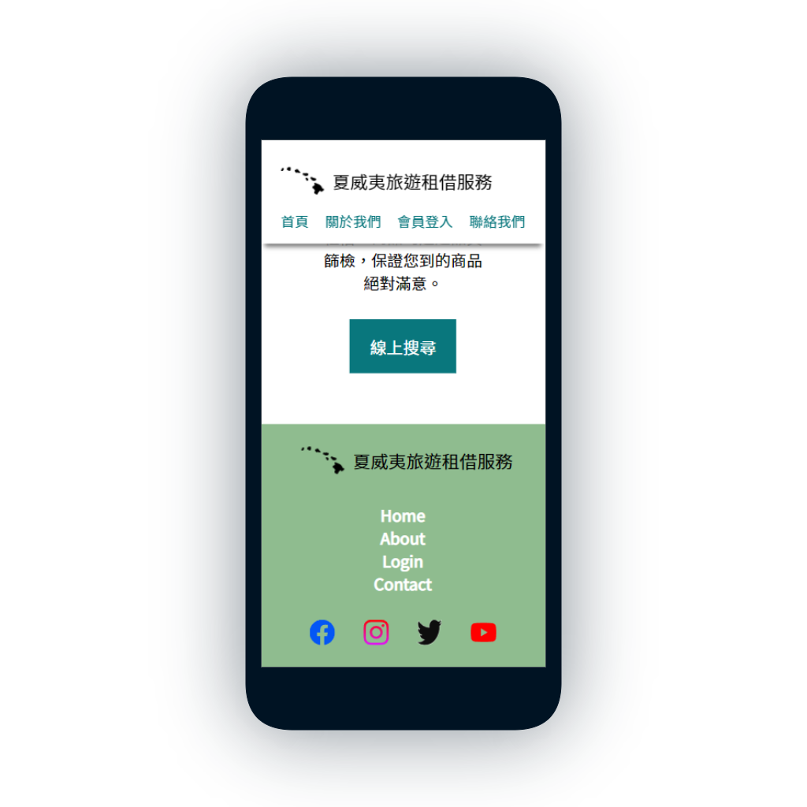

<!--
*** Thanks for checking out the Hawaii-Travel. If you have a suggestion
*** that would make this better, please fork the repo and create a pull request
*** or simply open an issue with the tag "enhancement".
*** Thanks again! Now go create something AMAZING! :D
***
*** To avoid retyping too much info. Do a search and replace for the following:
*** github_username (that is "windsuzu"), repo_name (that is "Hawaii-Travel"), project_title, project_description
-->

<!-- [![Issues][issues-shield]][issues-url] -->
<!-- [![PR Welcome][pr-welcome-shield]](#contributing) -->
[![Contributors][contributors-shield]][contributors-url]
[![MIT License][license-shield]][license-url]
[![Author][author-shield]][author-url]
[![LinkedIn][linkedin-shield]][linkedin-url]

<!-- PROJECT LOGO -->
 

  
  <h3 align="center">Hawaii Travel</h3>
  

    Hawaii Travel Rental Service Website
     
    <a href="https://windsuzu.github.io/Hawaii-Travel">View Demo</a>
    ·
    <a href="https://github.com/windsuzu/Hawaii-Travel/issues">Report Bug</a>
  

Table of Contents

* [About](#about)
* [Preview](#preview)
  * [Web](#web)
  * [SmartPhone](#smartphone)
* [License](#license)
* [Contact](#contact)
* [Acknowledgements](#acknowledgements)

---

<!-- ABOUT THE PROJECT -->
## About

<table>
<tr>
<td>

這個 Hawaii Travel 是一個模擬夏威夷旅遊租借服務的網站，沒有實作任何功能性，主要用於練習 HTML 5, CSS 3 以及 SCSS。該網站的特色有:

- 實作 FlexBox, Media Query 自適應 (RWD) 網頁
- 實作黏性導覽列 (sticky navigation bar)
- 實作一頁式展示頁面 (cover)
- 實作圖片縮放特效 (image scale effect)
- 實作頁尾 (footer)

Built With:

* HTML 5
* CSS 3
* SCSS

</td>
</tr>
</table>

---

## Preview

### Web

    
    
    

### SmartPhone

    
    
    
    

---

## License

Distributed under the MIT License. See [LICENSE](https://github.com/windsuzu/Hawaii-Travel/blob/main/LICENSE) for more information.

## Contact

Reach out to the maintainer at one of the following places:

* [GitHub discussions](https://github.com/windsuzu/Hawaii-Travel/discussions)
* The email which is located [in GitHub profile](https://github.com/windsuzu)

## Acknowledgements

* [Wilson Ren](https://www.udemy.com/user/wilson-r-6/)
* 
Icons made by <a href="https://www.flaticon.com/authors/ultimatearm" title="ultimatearm">ultimatearm</a> from <a href="https://www.flaticon.com/" title="Flaticon">www.flaticon.com</a>

[contributors-shield]: https://img.shields.io/github/contributors/windsuzu/Hawaii-Travel.svg?style=for-the-badge
[contributors-url]: https://github.com/windsuzu/Hawaii-Travel/graphs/contributors
[issues-shield]: https://img.shields.io/github/issues/windsuzu/Hawaii-Travel.svg?style=for-the-badge
[issues-url]: https://github.com/windsuzu/Hawaii-Travel/issues
[license-shield]: https://img.shields.io/github/license/windsuzu/Hawaii-Travel.svg?style=for-the-badge&label=license
[license-url]: https://github.com/windsuzu/Hawaii-Travel/blob/main/LICENSE
[linkedin-shield]: https://img.shields.io/badge/-LinkedIn-black.svg?style=for-the-badge&logo=linkedin&colorB=555
[linkedin-url]: https://linkedin.com/in/windsuzu
[pr-welcome-shield]: https://shields.io/badge/PRs-Welcome-ff69b4?style=for-the-badge
[author-shield]: https://shields.io/badge/Made_with_%E2%9D%A4_by-windsuzu-F4A92F?style=for-the-badge
[author-url]: https://github.com/windsuzu